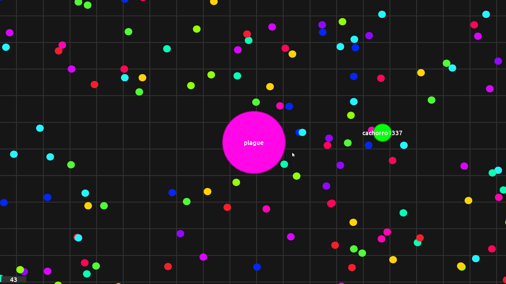
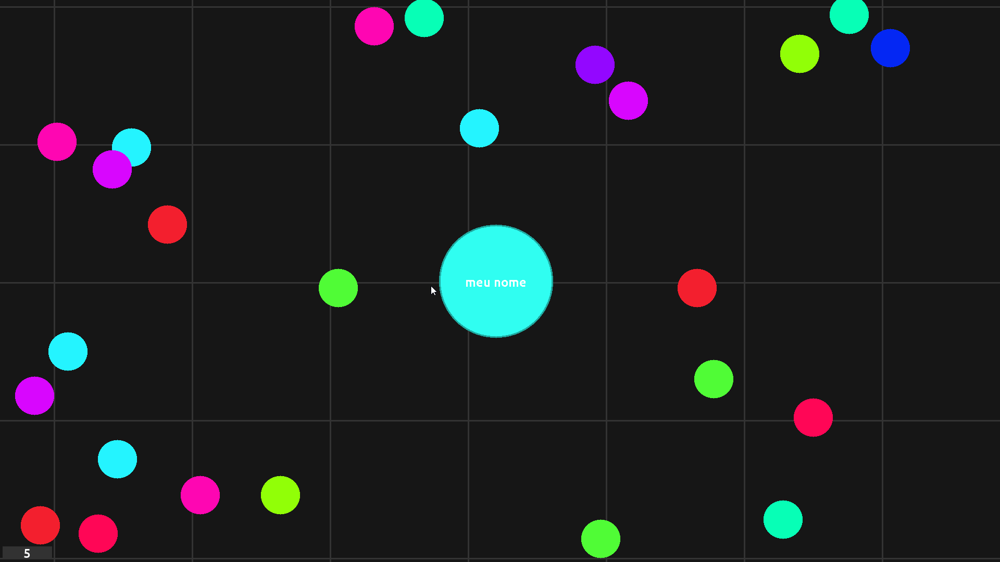

# pygario
A clone of [agar.io](https://agar.io/) made in pygame by me, occasionally as my final work for INE5402-01208B (20241) - Object Oriented Programming I at the Federal University of Santa Catarina.

[leia em português](./README.md)

# Install

Make sure you have the required packages:

```sh
pip install -r requirements.txt
```

Then you can run the game with:

```sh
python main.py <player_name> <bot_quantity>
```

For help run either just run `main.py` or run:

```sh
python main.py -h
```

# How to play

- Use the mouse to move, you gain mass by eating other cells and bots.

- Your score is shown in the bottom left corner of the screen.

- Other bots are also on the map trying to be the winner.

# Screenshots


<br>


